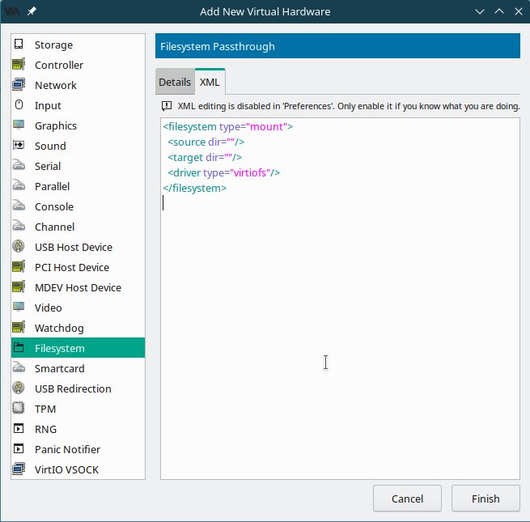

# Kernel-based Virtual Machine Usage

Last modified: 2024-03-28 UTC

- [Installation](#installation)
- [Start service](#start-service)
- [Virtual network](#virtual-network)
  - [WARP issue](#warp-issue)
- [USB redirect](#usb-redirect)
  - [Permission issue](#permission-issue)
  - [USB redirect using `virsh`](#usb-redirect-using-virsh)
- [Sharing files between host and guest](#sharing-files-between-host-and-guest)
  - [Linux guest](#linux-guest)
- [GPU passthrough](#gpu-passthrough)
- [Suspend a VM](#suspend-a-vm)
- [Clone a VM](#clone-a-vm)
  - [Cloning using `virt-manager`](#cloning-using-virt-manager)
  - [Cloning using `virt-clone`](#cloning-using-virt-clone)
- [Manage snapshots](#manage-snapshots)
- [Manage VM storage](#manage-vm-storage)
- [Looking Glass](#looking-glass)
  - [Interesting posts](#interesting-posts)
  - [virtio and SPICE drivers (on guest)](#virtio-and-spice-drivers-on-guest)
  - [IVSHMEM (on host)](#ivshmem-on-host)
  - [Mouse and keyboard (on host)](#mouse-and-keyboard-on-host)
  - [Build client (on host)](#build-client-on-host)
    - [Prerequisite](#prerequisite)
  - [Run client (on host)](#run-client-on-host)
  - [Screen tearing](#screen-tearing)
    - [KDE compositor (on host) (Plasma 5 on X11)](#kde-compositor-on-host-plasma-5-on-x11)
    - [TearFree (on host)](#tearfree-on-host)

## Installation

- openSUSE: [[openSUSE/dev-env#KVM]]

## Start service

Before running Virtual Machine Manager, enable related services via the following commands:

```bash
systemctl start libvirtd.service
```

The following alias can be set for convenience:

```bash
alias vstart='sudo systemctl start libvirtd.service && systemctl status libvirtd.service && sudo virsh net-start default && sudo virsh net-list --all && virt-manager'
```

*References*:

- [7.1 Starting and stopping the monolithic daemon](https://doc.opensuse.org/documentation/leap/virtualization/single-html/book-virtualization/#libvirt-monolithic-daemon)

## Virtual network

### WARP issue

At the time of writing (*Tumbleweed 20230727, warp-cli 2023.7.40*), first disable WARP then enable WARP.

*References*:

- [XML format](https://wiki.libvirt.org/VirtualNetworking.html#xml-format)
- [What is the difference between virbr# and vnet#?](https://unix.stackexchange.com/questions/52855/what-is-the-difference-between-virbr-and-vnet)
- [WARP breaks KVM/libvirt networking on Linux (Virt-manager)](https://community.cloudflare.com/t/warp-breaks-kvm-libvirt-networking-on-linux-virt-manager/533205)

## USB redirect

### Permission issue

At the time of writing (*Tumbleweed 20230727, kvm_tools 20210330-5.1, libvirt 9.5.0-2.1*), add the user to the `kvm` group to grant access.

*References*:

- [error when redirecting usb in virt-manager](https://www.reddit.com/r/openSUSE/comments/buhkdb/error_when_redirecting_usb_in_virtmanager/)
- [Redirecting USB device to a virtual machine with virt-manager does not work](https://serverfault.com/questions/1073182/redirecting-usb-device-to-a-virtual-machine-with-virt-manager-does-not-work)

### USB redirect using `virsh`

1. Create an XML file and give it a logical name. Make sure to copy the vendor and product IDs exactly as was displayed in `lsusb -v`. For example, my *Bus 002 Device 002: ID 0951:1666 Kingston Technology DataTraveler 100 G3/G4/SE9 G2/50* device will have the following XML:

   ```xml
   <hostdev mode='subsystem' type='usb' managed='yes'>
     <source>
       <vendor id='0x0951'/>
       <product id='0x1666'/>
     </source>
   </hostdev>
   ```

2. Attach the device via the following commands:

   ```bash
   virsh attach-device VM-NAME --file USB-DEVICE.xml --current
   ```

3. Detach the device via the following commands:

   ```bash
   virsh detach-device VM-NAME --file USB-DEVICE.xml
   ```

*References*:

- [14.2. Attaching and Updating a Device with virsh](https://access.redhat.com/documentation/en-us/red_hat_enterprise_linux/6/html/virtualization_administration_guide/sect-managing_guest_virtual_machines_with_virsh-attaching_and_updating_a_device_with_virsh)

## Sharing files between host and guest

### Linux guest

1. Enable shared memory:

   

2. Add hardware:

   

   Then edit XML as follows:

   ```xml
   <filesystem type="mount" accessmode="passthrough">
     <source dir="HOST_SHARE_PATH"/>
     <target dir="GUEST_SHARE_PATH"/>
     <driver type="virtiofs"/>
   </filesystem>
   ```

   Note that for old distro having kernel version lower than *Linux v5.4* (e.g. *Ubuntu 16.04*), `9p` should be used instead of `virtiofs`. Supported FS could be checked via the following commands:

   ```bash
   cat /etc/filesystems
   cat /proc/filesystems
   ls /lib/modules/$(uname -r)/kernel/fs
   ```

3. Mount the shared directory within the guest operating system via the following commands:

   ```bash
   mkdir -v ~/shared
   sudo mount -t virtiofs GUEST_SHARE_PATH ~/shared
   ```

*References*:

- [12.3 Sharing directories between host and guests (file system pass-through)](https://doc.opensuse.org/documentation/leap/virtualization/single-html/book-virtualization/#sec-libvirt-storage-share)
- [Sharing files with Virtiofs](https://libvirt.org/kbase/virtiofs.html)
- [Documentation/9psetup](https://wiki.qemu.org/Documentation/9psetup)
- [Libvirt](https://discourse.ubuntu.com/t/libvirt/11522)
- [Share Folder Between Guest and Host in virt-manager (KVM/Qemu/libvirt)](https://www.debugpoint.com/share-folder-virt-manager/)
- [Share Files Between KVM Host and Linux Guest Using Virtiofs](https://sysguides.com/share-files-between-kvm-host-and-linux-guest-using-virtiofs/)
- [Using file system passthrough with KVM guests](https://askubuntu.com/questions/1014674/using-file-system-passthrough-with-kvm-guests)
- [The new shared folder implementation appears to be virtio-9p/"virtfs" rather than virtiofs.](https://github.com/utmapp/UTM/issues/4386#issuecomment-1242033554)
- [Mount Device With Specific User Rights](https://www.baeldung.com/linux/mount-user-rights)

## GPU passthrough

1. Enable IOMMU by adding the following to boot parameter:

   ```text
   iommu=pt intel_iommu=on rd.driver.pre=vfio-pci
   ```

2. Reboot and verify that IOMMU is enabled via the following commandL

   ```bash
   dmesg |  grep -e DMAR -e IOMMU
   ```

3. Configure VFIO and isolate the GPU:
   - Set `vfio-pci.ids` in boot parameter. On my machine (*ThinkPad P1 Gen2*), it's `vfio-pci.ids=10de:1fb8`.
   - Or create the file `/etc/modprobe.d/vfio.conf` with the following content:

     ```text
     options vfio-pci ids=10de:1fb8
     ```

4. Load the VFIO driver by adding the driver to the list of auto-loaded modules. Create the file `/etc/modules-load.d/vfio-pci.conf` and add the following content:

   ```text
   vfio
   vfio_iommu_type1
   vfio_pci
   kvm
   kvm_intel
   ```

5. Disable MSR for Microsoft Windows guests by creating the file `/etc/modprobe.d/kvm.conf` and adding the following content:

   ```text
   options kvm ignore_msrs=1
   ```

6. Reboot.

*References*:

- [Configuring GPU Pass-Through for NVIDIA cards](https://doc.opensuse.org/documentation/leap/virtualization/single-html/book-virtualization/#app-gpu-passthru)
- [3.1 Binding vfio-pci via device ID](https://wiki.archlinux.org/title/PCI_passthrough_via_OVMF#Binding_vfio-pci_via_device_ID)
- (Blacklisted by Looking Glass Discord server) [\[tutorial\] The Ultimate Linux Laptop for Gaming – feat. KVM and VFIO](https://www.youtube.com/watch?v=m8xj2Py8KPc)

## Suspend a VM

*References*:

- [Pause QEMU/KVM VM (save RAM and CPU state to disk) like vmware Player?](https://unix.stackexchange.com/questions/361010/pause-qemu-kvm-vm-save-ram-and-cpu-state-to-disk-like-vmware-player)

## Clone a VM

### Cloning using `virt-manager`

Note that at the time of writing (*Tumbleweed 20230727, libvirt 9.5.0-2.1*), cloning onto existing storage volume is not currently supported. But you can still change the path of the new virtual disk to be created (do **not** click that "Browse" button):


*References*:

- [3.2.2. Cloning Guests with virt-manager](https://access.redhat.com/documentation/en-us/red_hat_enterprise_linux/6/html/virtualization_administration_guide/cloning_vms_with_virt-manager)
- [4.2.2. Cloning Guests with virt-manager](https://access.redhat.com/documentation/en-us/red_hat_enterprise_linux/7/html/virtualization_deployment_and_administration_guide/cloning-a-vm#Cloning_VMs_with_virt-manager)

### Cloning using `virt-clone`

*References*:

- [Clone a KVM virtual machine](https://docs.deistercloud.com/content/Tutorials.100/Linux.80/KVM%20virtualization.40/Clone%20a%20KVM%20virtual%20machine.6.xml?embedded=true)
- [kvm 虚拟化 virt-clone 克隆虚拟机](https://blog.csdn.net/wanglei_storage/article/details/51106096)
- [Cloning KVM snapshots - DEV Community](https://dev.to/mediocredevops/cloning-kvm-snapshots-1paj)

## Manage snapshots

- List snapshots as tree via the following commands:

  ```bash
  virsh snapshot-list VM_NAME --tree
  ```

- Rename snapshot via the following commands:

  ```bash
  virsh snapshot-edit VM_NAME --snapshotname SNAPSHOT_TO_BE_RENAMED --rename
  ```

## Manage VM storage

*References*:

- [18.3.4 virt-resize](https://doc.opensuse.org/documentation/leap/virtualization/single-html/book-virtualization/#sec-guestfs-tools-virt-resize)
- [How to Increase a KVM Virtual Machine's Disk Size](https://www.howtogeek.com/devops/how-to-increase-a-kvm-virtual-machines-disk-size/)
- [How To extend/increase KVM Virtual Machine (VM) disk size](https://computingforgeeks.com/how-to-extend-increase-kvm-virtual-machine-disk-size/?expand_article=1)

## Looking Glass

### Interesting posts

- [如何在Linux系統安裝Windows 11虛擬機(QEMU/KVM) ＋ 常用技巧](https://ivonblog.com/posts/install-windows-11-qemu-kvm-on-linux/)
- [如何在Windows虛擬機玩遊戲 ～ Linux QEMU/KVM雙GPU直通 ＋ Looking Glass安裝過程](https://ivonblog.com/posts/qemu-kvm-vfio-gaming/)

### virtio and SPICE drivers (on guest)

At the time of writing (*libvirt 9.5.0-2.1, virtio-win 0.1.229*), a virtio virtual disk must be attached when installing virtio drivers. Otherwise, the main virtual disk cannot be recognized if later changed from SATA to virtio.

*References*:

- [Downloads](https://github.com/virtio-win/virtio-win-pkg-scripts#downloads)
- [Download](https://www.spice-space.org/download.html)

### IVSHMEM (on host)

1. Add the following to VM xml's `device` section:

   ```xml
   <shmem name='looking-glass'>
     <model type='ivshmem-plain'/>
     <size unit='M'>32</size>
   </shmem>
   ```

2. Write the following to `/etc/tmpfiles.d/10-looking-glass.conf`:

   ```conf
   # Type Path               Mode UID GID Age Argument

   f /dev/shm/looking-glass 0660 USER kvm -
   ```

*References*:

- [IVSHMEM](https://looking-glass.io/docs/B6/install/#ivshmem)

### Mouse and keyboard (on host)

Make the following modifications to VM's xml:

- Find your `<video>` device, and set `<model type='vga'/>`.
- Remove the `<input type='tablet'/>` device, if you have one.
- Create an `<input type='mouse' bus='virtio'/>` device, if you don’t already have one.
- Create an `<input type='keyboard' bus='virtio'/>` device to improve keyboard usage.

Note that the following method is **not** recommended in the LG official Discord server:

~~Add the following XML to the VM config:~~

{::options parse_block_html="true" /}

<details>
<summary>Not recommended</summary>

```xml
<input type="evdev">
    <source dev="/dev/input/by-id/usb-Logitech_USB_Receiver-if01-event-mouse"/>
</input>
<input type="evdev">
    <source dev="/dev/input/by-path/platform-i8042-serio-0-event-kbd" grab="all" grabToggle="ctrl-ctrl" repeat="on"/>
</input>
```

</details>

{::options parse_block_html="false" /}

*References*:

- [Keyboard/mouse/display/audio](https://looking-glass.io/docs/B6/install/#keyboard-mouse-display-audio)

### Build client (on host)

#### Prerequisite

Use `sudo zypper install binutils-devel make cmake fontconfig-devel libSDL2-devel libSDL2_ttf-devel spice-protocol-devel libX11-devel libnettle-devel wayland-protocols-devel libconfig-devel libXi-devel libXss-devel libwayland-egl-devel nettle` to install prerequisites.

Here is the output on my machine:

```text
sudo zypper install binutils-devel make cmake fontconfig-devel libSDL2-devel libSDL2_ttf-devel spice-protocol-devel libX11-devel libnettle-devel wayland-protocols-devel libconfig-devel libXi-devel libXss-devel libwayland-egl-devel nettle
[sudo] password for root:
Loading repository data...
Reading installed packages...
'make' is already installed.
No update candidate for 'make-4.4.1-2.2.x86_64'. The highest available version is already installed.
'fontconfig-devel' is already installed.
No update candidate for 'fontconfig-devel-2.14.2-1.3.x86_64'. The highest available version is already installed.
'binutils-devel' is already installed.
No update candidate for 'binutils-devel-2.40-5.2.x86_64'. The highest available version is already installed.
'libXi-devel' is already installed.
No update candidate for 'libXi-devel-1.8.1-1.1.x86_64'. The highest available version is already installed.
'libSDL2-devel' not found in package names. Trying capabilities.
'libSDL2_ttf-devel' not found in package names. Trying capabilities.
'libwayland-egl-devel' not found in package names. Trying capabilities.
'wayland-devel' providing 'libwayland-egl-devel' is already installed.
Resolving package dependencies...

The following 6 packages are going to be upgraded:
  cmake cmake-full libX11-6 libX11-data libX11-devel libX11-xcb1

The following 12 NEW packages are going to be installed:
  glu-devel libconfig-devel libnettle-devel libSDL2_ttf-2_0-0 libXss-devel Mesa-libGLESv1_CM-devel Mesa-libGLESv2-devel nettle
  SDL2-devel SDL2_ttf-devel spice-protocol-devel wayland-protocols-devel

6 packages to upgrade, 12 new.
```

Then I encountered this issue:

```text
-- Could NOT find BFD_LIBZ (missing: BFD_LIBZ_LIBRARIES)
CMake Error at /home/az/workspace/looking-glass-B6/common/cmake/FindBFD.cmake:28 (message):
  Using static libbfd.a, but libz.a not available
Call Stack (most recent call first):
  /home/az/workspace/looking-glass-B6/common/src/platform/linux/CMakeLists.txt:23 (find_package)
```

So I have to install `zlib-devel-static`.

The I encountered this issue:

```text
-- Checking for modules 'x11;xi;xfixes;xscrnsaver;xinerama;xcursor;xpresent;xkbcommon'
--   Package 'xpresent', required by 'virtual:world', not found
CMake Error at /usr/share/cmake/Modules/FindPkgConfig.cmake:607 (message):
  A required package was not found
Call Stack (most recent call first):
  /usr/share/cmake/Modules/FindPkgConfig.cmake:829 (_pkg_check_modules_internal)
  displayservers/X11/CMakeLists.txt:5 (pkg_check_modules)
```

So I have to install `libXpresent-devel`.

Then I encountered this issue:

```text
-- Checking for module 'libpipewire-0.3'
--   Package 'libpipewire-0.3', required by 'virtual:world', not found
CMake Error at /usr/share/cmake/Modules/FindPkgConfig.cmake:607 (message):
  A required package was not found
Call Stack (most recent call first):
  /usr/share/cmake/Modules/FindPkgConfig.cmake:829 (_pkg_check_modules_internal)
  audiodevs/PipeWire/CMakeLists.txt:5 (pkg_check_modules)
```

So I have to install `pipewire-devel`.

Then I encountered this issue:

```text
-- Checking for module 'libpulse'
--   Package 'libpulse', required by 'virtual:world', not found
CMake Error at /usr/share/cmake/Modules/FindPkgConfig.cmake:607 (message):
  A required package was not found
Call Stack (most recent call first):
  /usr/share/cmake/Modules/FindPkgConfig.cmake:829 (_pkg_check_modules_internal)
  audiodevs/PulseAudio/CMakeLists.txt:5 (pkg_check_modules)
```

So I have to install `libpulse-devel`.

Then I encountered this issue:

```text
-- Checking for module 'samplerate'
--   Package 'samplerate', required by 'virtual:world', not found
CMake Error at /usr/share/cmake/Modules/FindPkgConfig.cmake:607 (message):
  A required package was not found
Call Stack (most recent call first):
  /usr/share/cmake/Modules/FindPkgConfig.cmake:829 (_pkg_check_modules_internal)
  CMakeLists.txt:182 (pkg_check_modules)
```

So I have to install `libsamplerate-devel`.

Then I encountered this issue:

```text
In file included from /home/az/workspace/looking-glass-B6/client/displayservers/X11/x11.c:46:
/home/az/workspace/looking-glass-B6/client/include/egl_dynprocs.h:28:10: fatal error: GLES3/gl3.h: No such file or directory
   28 | #include <GLES3/gl3.h>
      |          ^~~~~~~~~~~~~
compilation terminated.
```

So I have to install `Mesa-libGLESv3-devel`.

Then I succeed via `cmake -DENABLE_BACKTRACE=0 ../` and `make install`.

*References*:

- [Building](https://looking-glass.io/docs/B6/build/)
- [OpenSuSE Leap 15.0+](https://looking-glass.io/wiki/Installation_on_other_distributions#OpenSuSE_Leap_15.0.2B)
- [Client `make` fails to build on arch with "DSO missing from command line"](https://github.com/gnif/LookingGlass/issues/1056#issuecomment-1399147873)

### Run client (on host)

Use ~~`looking-glass-client -s -m KEY_HOME`~~ `looking-glass-client -m KEY_HOME`. Note that it's not necessary to set the menu key to be `KEY_HOME`. By default it's `KEY_SCROLLLOCK`.

### Screen tearing

#### KDE compositor (on host) (Plasma 5 on X11)

Forbid apps from blocking compositing (it drops framerate):


*References*:

- [Compositing window manager](https://en.wikipedia.org/wiki/Compositing_window_manager)
- [What is a compositor (in general), and which gives the best performance (Ubuntu Mate 16.04)?](https://unix.stackexchange.com/questions/359257/what-is-a-compositor-in-general-and-which-gives-the-best-performance-ubuntu)
- [Compositor (X11)](https://linux-gaming.kwindu.eu/index.php?title=Compositor_(X11))

#### TearFree (on host)

Edit `/etc/X11/xorg.conf.d/20-intel.conf`. But this failed to work on my machine.

*References*:

- [6.1.2 With the modesetting driver](https://wiki.archlinux.org/title/Intel_graphics#With_the_modesetting_driver)
- [How to fix video tearing in Linux (with Intel graphics)](https://www.dedoimedo.com/computers/linux-intel-graphics-video-tearing.html)
- [Changing driver into modesetting](https://askubuntu.com/questions/956759/changing-driver-into-modesetting)

[//begin]: # "Autogenerated link references for markdown compatibility"
[openSUSE/dev-env#KVM]: openSUSE/dev-env.md "openSUSE Development Environment"
[//end]: # "Autogenerated link references"
