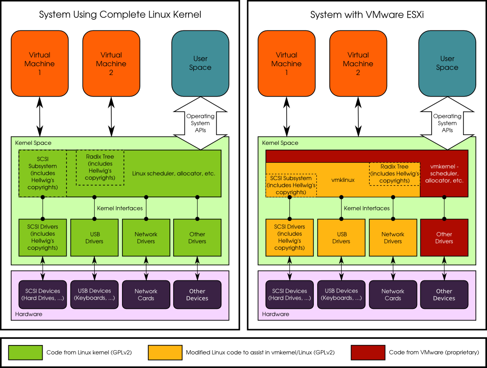

---
sitemap:
  lastmod: 2025-07-15 +0000
---

# ESXi

Last modified: 2025-07-15 +0000

**NOTE**: The content of the post are mostly tested on *ESXi 6.5.0*.

## Interesting posts

- [Is ESXi a firmware or an OS software? - Quora](https://www.quora.com/Is-ESXi-a-firmware-or-an-OS-software)

  

- [Configuring Network Settings](https://docs.vmware.com/en/VMware-vSphere/8.0/vsphere-esxi-installation/GUID-26F3BC88-DAD8-43E7-9EA0-160054954506.html)
- [How to Export Snapshot on VMware without Losing Data](https://www.ubackup.com/enterprise-backup/export-snapshot-vmware.html)
- [ESXi 7 - VM snapshot backup : r/vmware](https://www.reddit.com/r/vmware/comments/1d78jqd/esxi_7_vm_snapshot_backup/)

## Clone VMs

*References*:

- [How to Clone VMs in VMware ESXi With or Without vCenter](https://www.nakivo.com/blog/vmware-esxi-clone-vm/)
