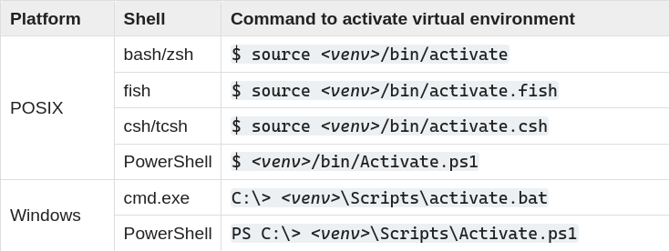

# Python

Last modified: 2023/12/18 16:06:03

- [Interesting posts](#interesting-posts)
- [VSCode](#vscode)
  - [`settings.json`](#settingsjson)
  - [`extension.json`](#extensionjson)
- [Version manager](#version-manager)
- [Environment](#environment)
  - [venv](#venv)
    - [Create virtual environment](#create-virtual-environment)
    - [Activate virtual environment](#activate-virtual-environment)
  - [pip packages](#pip-packages)
  - [pipx](#pipx)
- [Data Engineering](#data-engineering)

## Interesting posts

- [Status of Python versions](https://devguide.python.org/versions/)
- [A Python Interpreter Written in Python](https://aosabook.org/en/500L/a-python-interpreter-written-in-python.html)

## VSCode

### `settings.json`

```json
"[python]": {
  "editor.formatOnSave": true,
  "editor.formatOnType": true
},
"python.analysis.autoImportCompletions": true,
"python.analysis.inlayHints.callArgumentNames": "partial",
"python.analysis.inlayHints.functionReturnTypes": true,
"python.analysis.inlayHints.pytestParameters": true,
"python.analysis.inlayHints.variableTypes": true,
// "python.defaultInterpreterPath": "${workspaceFolder}/.venv/bin/python",
// "python.defaultInterpreterPath": "${workspaceFolder}\\.venv\\Scripts\\python.exe",
"python.formatting.provider": "black",
"python.formatting.blackArgs": [
  "--line-length",
  "80"
],
"python.linting.mypyEnabled": true,
```

### `extension.json`

```json
"recommendations": [
  "ms-python.python",
  "ms-toolsai.jupyter",
  "visualstudioexptteam.vscodeintellicode",
  "kevinrose.vsc-python-indent",
  "twixes.pypi-assistant",
  "donjayamanne.python-environment-manager",
]
```

## Version manager

- Pyenv:
  - openSUSE Tumbleweed: [[Tumbleweed/dev-env#Pyenv]]

## Environment

### venv

#### Create virtual environment

Use `python3 -m venv --upgrade-deps PATH/TO/NEW/VENV`.

*References*:

- [Creating virtual environments](https://docs.python.org/3/library/venv.html#creating-virtual-environments)

#### Activate virtual environment



*References*:

- [How venvs work](https://docs.python.org/3/library/venv.html#how-venvs-work)

### pip packages

- [`black[jupyter]`](https://black.readthedocs.io/en/stable/getting_started.html#installation) for formatting
- [`mypy`](https://mypy.readthedocs.io/en/stable/getting_started.html#installing-and-running-mypy) for linting
- [`ipykernel`](https://ipython.readthedocs.io/en/stable/install/kernel_install.html#kernels-for-python-2-and-3) for VSCode Jupyter support

### pipx

- [pipx](https://pypa.github.io/pipx/)

## Data Engineering

- [Feature Engineering: Scaling, Normalization, and Standardization](https://www.analyticsvidhya.com/blog/2020/04/feature-scaling-machine-learning-normalization-standardization/)

[//begin]: # "Autogenerated link references for markdown compatibility"
[Tumbleweed/dev-env#Pyenv]: ..%2Fnotes-OS%2FLinux%2FopenSUSE%2FTumbleweed%2Fdev-env.md "OpenSUSE Tumbleweed Development Environment"
[//end]: # "Autogenerated link references"
