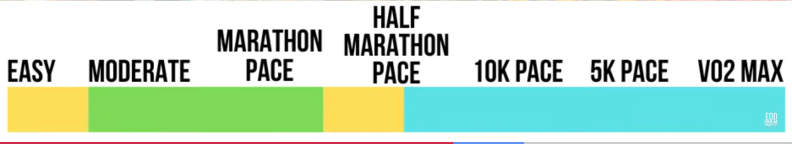

# Running

Last modified: 2024/01/30 UTC

- [Interesting posts](#interesting-posts)
- [Pace](#pace)
- [UltrAspire](#ultraspire)
- [Activities in HK](#activities-in-hk)

## Interesting posts

- [Runner's World's Training Pace Calculator](https://assets.hearstapps.com/rwtools/rws-training-pace-calculator.html)
- [Running Cadence: Why it Matters and How to Improve Yours \| Wahoo Fitness Blog](https://www.wahoofitness.com/blog/running-cadence-why-it-matters-and-how-to-improve-yours/)
- [How to Use Running Cadence to Avoid Injuries \| Matthew Boyd Physio](https://matthewboydphysio.com/use-running-cadence-avoid-injuries/)
- [The 6 Best Running Hydration Packs of 2023 \| Tested by GearLab](https://www.outdoorgearlab.com/topics/fitness/best-hydration-pack-for-running)
- [Running Science \| Garmin Technology](https://www.garmin.com/en-US/garmin-technology/running-science/)
- [Running Science - Entry Level \| Garmin Singapore](https://www.garmin.com.sg/minisite/garmin-technology/running/entry-level/)

## Pace

## UltrAspire

## Activities in HK

- 文化飛步遊
