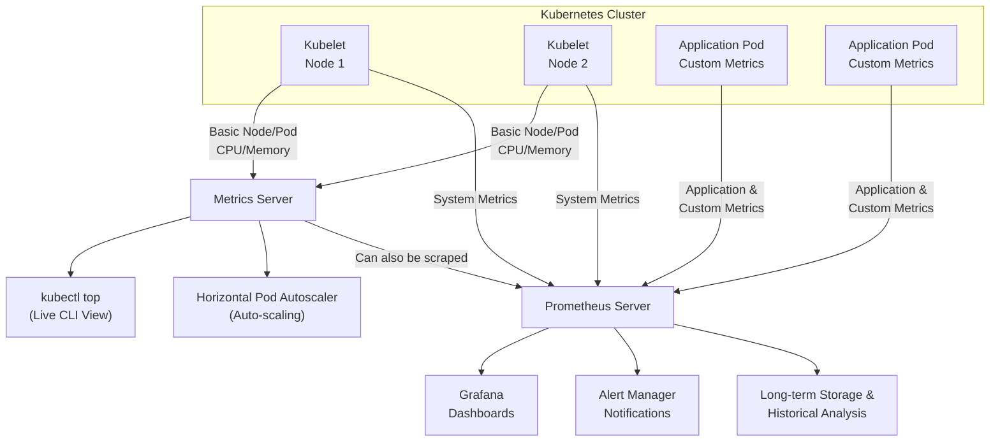

---
sitemap:
  lastmod: 2025-12-04 +0000
---

# Kubernetes Metrics

Last modified: 2025-12-04 +0000

## Metrics Server vs Prometheus

TL;DR, Metrics Server is for live resource dashboards, while Prometheus is for historical analytics and alerting.

| Aspect         | Metrics Server                                                                                                                                     | Prometheus                                                                                                                                                                            |
| :------------- | :------------------------------------------------------------------------------------------------------------------------------------------------- | :------------------------------------------------------------------------------------------------------------------------------------------------------------------------------------ |
| Core Purpose   | **Live, short-term resource dashboard.** Provides real-time CPU/Memory usage for `kubectl top` and the Kubernetes Horizontal Pod Autoscaler (HPA). | **Comprehensive monitoring & alerting system.** Collects, stores, and queries a vast array of time-series metrics for long-term analysis, visualization, and alerting.                |
| Data Scope     | Narrow: Only basic node and pod CPU/Memory usage.                                                                                                  | Broad: System metrics, application metrics, custom business metrics, and everything Metrics Server provides (via a scraper).                                                          |
| Data Retention | Very short (in-memory, minutes). Not for history.                                                                                                  | Long-term (days to years) on its own time-series database.                                                                                                                            |
| Primary User   | **Kubernetes itself** (for autoscaling) and **cluster operators** (for quick CLI checks).                                                          | **SREs, DevOps engineers, developers** (for troubleshooting, capacity planning, and application performance monitoring).                                                              |
| Key Use Case   | - `kubectl top nodes/pods` - **Autoscaling pods based on CPU/Memory**                                                                           | - Creating dashboards (e.g., in Grafana) - Setting complex alerts (e.g., error rate > 1%) - Debugging performance issues over time - Monitoring application-specific metrics |
| Architecture   | Simple: Single component that fetches data from kubelets.                                                                                          | Complex: Multi-component ecosystem (server, exporters, alertmanager, client libraries).                                                                                               |

### How They Work Together

Like a **two layers of a monitoring stack**:

1.  **Layer 1: Metrics Server** - The essential, minimal layer for core Kubernetes operations (autoscaling).
2.  **Layer 2: Prometheus** - The full-featured observability platform built on top. Prometheus can even *scrape metrics from the Metrics Server* to centralize them with other data.

The diagram below illustrates this relationship and their position in the Kubernetes monitoring architecture:

