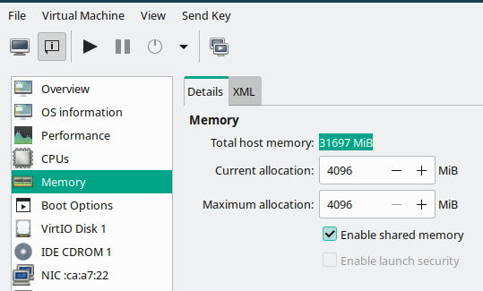

# Kernel-based Virtual Machine Usage

- [Start service](#start-service)
- [Virtual networks](#virtual-networks)
- [Shared directory](#shared-directory)
  - [Linux guest](#linux-guest)
  - [Windows guest](#windows-guest)
- [GPU passthrough](#gpu-passthrough)
  - [Windows guest](#windows-guest-1)
- [USB redirect](#usb-redirect)
- [Looking Glass](#looking-glass)
  - [Build client](#build-client)
    - [Prerequisite](#prerequisite)
  - [Mouse and keyboard](#mouse-and-keyboard)
  - [Run client](#run-client)
  - [Run host](#run-host)

For installation, see:

- [[Tumbleweed/dev_env#KVM]]

## Start service

Before running Virtual Machine Manager, enable related services via the following commands:

```bash
systemctl start libvirtd.service
```

The following alias can be set for convenience:

```bash
alias vstart='sudo systemctl start libvirtd.service && systemctl status libvirtd.service && sudo virsh net-start default && sudo virsh net-list --all && virt-manager'
```

*References*:

- [7.1 Starting and stopping the monolithic daemon](https://doc.opensuse.org/documentation/leap/virtualization/single-html/book-virtualization/#libvirt-monolithic-daemon)

## Virtual networks

At the time of writing (*Tumbleweed 20230118*), first disable WARP then enable WARP.

*References*:

- [XML format](https://wiki.libvirt.org/VirtualNetworking.html#xml-format)
- [What is the difference between virbr# and vnet#?](https://unix.stackexchange.com/questions/52855/what-is-the-difference-between-virbr-and-vnet)
- [WARP breaks KVM/libvirt networking on Linux (Virt-manager)](https://community.cloudflare.com/t/warp-breaks-kvm-libvirt-networking-on-linux-virt-manager/533205)

## Shared directory

### Linux guest

1. Enable shared memory:

   

2. Add hardware:

   

   Then edit XML as follows:

   ```xml
   <filesystem type="mount" accessmode="passthrough">
     <source dir="HOST_SHARE_PATH"/>
     <target dir="GUEST_SHARE_PATH"/>
     <driver type="virtiofs"/>
   </filesystem>
   ```

   Note that for old distro having kernel version lower than *Linux v5.4* (e.g. *Ubuntu 16.04*), `9p` should be used instead of `virtiofs`. Supported FS could be checked via the following commands:

   ```bash
   cat /etc/filesystems
   cat /proc/filesystems
   ls /lib/modules/$(uname -r)/kernel/fs
   ```

3. Mount the shared directory within the guest operating system via the following commands:

   ```bash
   mkdir -v ~/shared
   sudo mount -t virtiofs GUEST_SHARE_PATH ~/shared
   ```

*References*:

- [Sharing files with Virtiofs](https://libvirt.org/kbase/virtiofs.html)
- [Documentation/9psetup](https://wiki.qemu.org/Documentation/9psetup)
- [Libvirt](https://discourse.ubuntu.com/t/libvirt/11522)
- [Share Folder Between Guest and Host in virt-manager (KVM/Qemu/libvirt)](https://www.debugpoint.com/share-folder-virt-manager/)
- [Share Files Between KVM Host and Linux Guest Using Virtiofs](https://sysguides.com/share-files-between-kvm-host-and-linux-guest-using-virtiofs/)
- [Using file system passthrough with KVM guests](https://askubuntu.com/questions/1014674/using-file-system-passthrough-with-kvm-guests)
- [The new shared folder implementation appears to be virtio-9p/"virtfs" rather than virtiofs.](https://github.com/utmapp/UTM/issues/4386#issuecomment-1242033554)
- [Mount Device With Specific User Rights](https://www.baeldung.com/linux/mount-user-rights)

### Windows guest

## GPU passthrough

- Set `vfio-pci.ids=10de:1fb8` in the boot parameter.

### Windows guest

*References*:

- [Configuring GPU Pass-Through for NVIDIA cards](https://doc.opensuse.org/documentation/leap/virtualization/html/book-virtualization/app-gpu-passthru.html)
- [3.1 Binding vfio-pci via device ID](https://wiki.archlinux.org/title/PCI_passthrough_via_OVMF#Binding_vfio-pci_via_device_ID)
- [\[tutorial\] The Ultimate Linux Laptop for Gaming – feat. KVM and VFIO](https://www.youtube.com/watch?v=m8xj2Py8KPc)

## USB redirect

*References*:

- [error when redirecting usb in virt-manager](https://www.reddit.com/r/openSUSE/comments/buhkdb/error_when_redirecting_usb_in_virtmanager/)

## Looking Glass

### Build client

#### Prerequisite

Use `sudo zypper install binutils-devel make cmake fontconfig-devel libSDL2-devel libSDL2_ttf-devel spice-protocol-devel libX11-devel libnettle-devel wayland-protocols-devel libconfig-devel libXi-devel libXss-devel libwayland-egl-devel nettle` to install prerequisites.

Here is the output on my machine:

```text
sudo zypper install binutils-devel make cmake fontconfig-devel libSDL2-devel libSDL2_ttf-devel spice-protocol-devel libX11-devel libnettle-devel wayland-protocols-devel libconfig-devel libXi-devel libXss-devel libwayland-egl-devel nettle
[sudo] password for root:
Loading repository data...
Reading installed packages...
'make' is already installed.
No update candidate for 'make-4.4.1-2.2.x86_64'. The highest available version is already installed.
'fontconfig-devel' is already installed.
No update candidate for 'fontconfig-devel-2.14.2-1.3.x86_64'. The highest available version is already installed.
'binutils-devel' is already installed.
No update candidate for 'binutils-devel-2.40-5.2.x86_64'. The highest available version is already installed.
'libXi-devel' is already installed.
No update candidate for 'libXi-devel-1.8.1-1.1.x86_64'. The highest available version is already installed.
'libSDL2-devel' not found in package names. Trying capabilities.
'libSDL2_ttf-devel' not found in package names. Trying capabilities.
'libwayland-egl-devel' not found in package names. Trying capabilities.
'wayland-devel' providing 'libwayland-egl-devel' is already installed.
Resolving package dependencies...

The following 6 packages are going to be upgraded:
  cmake cmake-full libX11-6 libX11-data libX11-devel libX11-xcb1

The following 12 NEW packages are going to be installed:
  glu-devel libconfig-devel libnettle-devel libSDL2_ttf-2_0-0 libXss-devel Mesa-libGLESv1_CM-devel Mesa-libGLESv2-devel nettle
  SDL2-devel SDL2_ttf-devel spice-protocol-devel wayland-protocols-devel

6 packages to upgrade, 12 new.
```

Then I encountered this issue:

```text
-- Could NOT find BFD_LIBZ (missing: BFD_LIBZ_LIBRARIES)
CMake Error at /home/az/workspace/looking-glass-B6/common/cmake/FindBFD.cmake:28 (message):
  Using static libbfd.a, but libz.a not available
Call Stack (most recent call first):
  /home/az/workspace/looking-glass-B6/common/src/platform/linux/CMakeLists.txt:23 (find_package)
```

So I have to install `zlib-devel-static`.

The I encountered this issue:

```text
-- Checking for modules 'x11;xi;xfixes;xscrnsaver;xinerama;xcursor;xpresent;xkbcommon'
--   Package 'xpresent', required by 'virtual:world', not found
CMake Error at /usr/share/cmake/Modules/FindPkgConfig.cmake:607 (message):
  A required package was not found
Call Stack (most recent call first):
  /usr/share/cmake/Modules/FindPkgConfig.cmake:829 (_pkg_check_modules_internal)
  displayservers/X11/CMakeLists.txt:5 (pkg_check_modules)
```

So I have to install `libXpresent-devel`.

Then I encountered this issue:

```text
-- Checking for module 'libpipewire-0.3'
--   Package 'libpipewire-0.3', required by 'virtual:world', not found
CMake Error at /usr/share/cmake/Modules/FindPkgConfig.cmake:607 (message):
  A required package was not found
Call Stack (most recent call first):
  /usr/share/cmake/Modules/FindPkgConfig.cmake:829 (_pkg_check_modules_internal)
  audiodevs/PipeWire/CMakeLists.txt:5 (pkg_check_modules)
```

So I have to install `pipewire-devel`.

Then I encountered this issue:

```text
-- Checking for module 'libpulse'
--   Package 'libpulse', required by 'virtual:world', not found
CMake Error at /usr/share/cmake/Modules/FindPkgConfig.cmake:607 (message):
  A required package was not found
Call Stack (most recent call first):
  /usr/share/cmake/Modules/FindPkgConfig.cmake:829 (_pkg_check_modules_internal)
  audiodevs/PulseAudio/CMakeLists.txt:5 (pkg_check_modules)
```

So I have to install `libpulse-devel`.

Then I encountered this issue:

```text
-- Checking for module 'samplerate'
--   Package 'samplerate', required by 'virtual:world', not found
CMake Error at /usr/share/cmake/Modules/FindPkgConfig.cmake:607 (message):
  A required package was not found
Call Stack (most recent call first):
  /usr/share/cmake/Modules/FindPkgConfig.cmake:829 (_pkg_check_modules_internal)
  CMakeLists.txt:182 (pkg_check_modules)
```

So I have to install `libsamplerate-devel`.

Then I encountered this issue:

```text
In file included from /home/az/workspace/looking-glass-B6/client/displayservers/X11/x11.c:46:
/home/az/workspace/looking-glass-B6/client/include/egl_dynprocs.h:28:10: fatal error: GLES3/gl3.h: No such file or directory
   28 | #include <GLES3/gl3.h>
      |          ^~~~~~~~~~~~~
compilation terminated.
```

So I have to install `Mesa-libGLESv3-devel`.

Then I succeed via `cmake -DENABLE_BACKTRACE=0 ../` and `make install`.

*References*:

- [Building](https://looking-glass.io/docs/B6/build/)
- [OpenSuSE Leap 15.0+](https://looking-glass.io/wiki/Installation_on_other_distributions#OpenSuSE_Leap_15.0.2B)
- [Client `make` fails to build on arch with "DSO missing from command line"](https://github.com/gnif/LookingGlass/issues/1056#issuecomment-1399147873)

### Mouse and keyboard

Add the following XML to the VM config:

```xml
<input type="evdev">
    <source dev="/dev/input/by-id/usb-Logitech_USB_Receiver-if01-event-mouse"/>
</input>
<input type="evdev">
    <source dev="/dev/input/by-path/platform-i8042-serio-0-event-kbd" grab="all" grabToggle="ctrl-ctrl" repeat="on"/>
</input>
```

### Run client

Use `looking-glass-client -s -m KEY_HOME`.

### Run host

[//begin]: # "Autogenerated link references for markdown compatibility"
[Tumbleweed/dev_env#KVM]: ../openSUSE/Tumbleweed/dev_env.md "OpenSUSE Tumbleweed Development Environment"
[//end]: # "Autogenerated link references"
