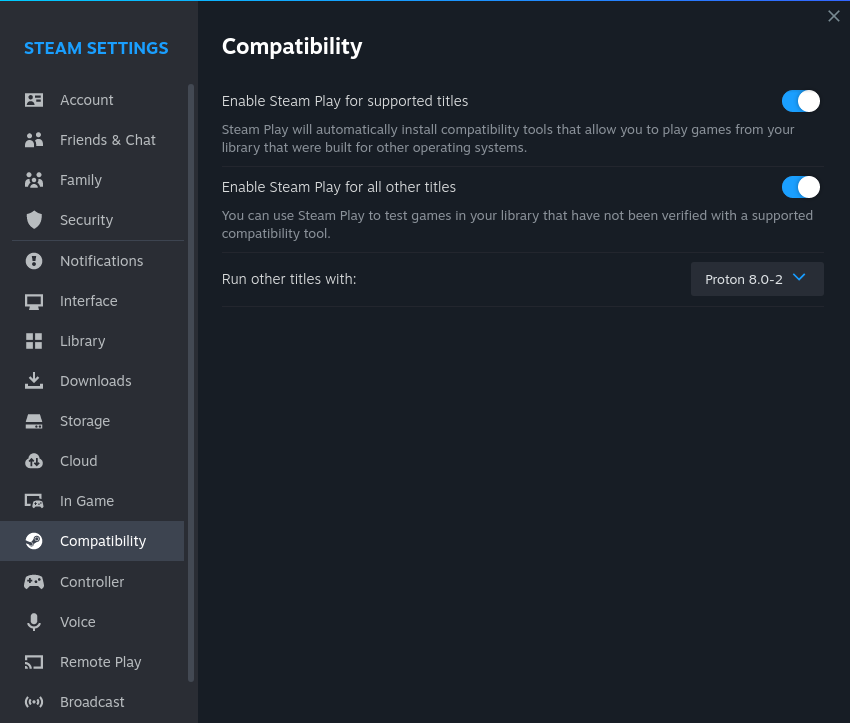

# Gaming on Linux

- [Gaming on Linux](#gaming-on-linux)
  - [Steam](#steam)
    - [Installation](#installation)
    - [Steam Play settings](#steam-play-settings)
    - [Play non-Steam games using Proton](#play-non-steam-games-using-proton)
    - [Gene Shift Auto](#gene-shift-auto)
    - [Super Animal Royal](#super-animal-royal)
    - [theHunter: Call of the Wild](#thehunter-call-of-the-wild)
  - [OpenSpades](#openspades)
    - [Tips](#tips)

## Steam

### Installation

- Install via `flatpak install flathub com.valvesoftware.Steam`.
  - For controller support, install drivers via `zypper install steam-devices`.
- Install Chinese font `wqy-zenhei`.
  - OpenSUSE Tumbleweed: `zypper install wqy-zenhei-fonts`.
- Run via `flatpak run com.valvesoftware.Steam`.

*References*:

- https://flathub.org/en-GB/apps/com.valvesoftware.Steam
- https://github.com/flathub/com.valvesoftware.Steam/wiki#my-controller-isnt-being-detected
- [Is there any real “disadvantages” to using the FlatPak version of Steam? ](https://www.reddit.com/r/linux_gaming/comments/rp2ss9/is_there_any_real_disadvantages_to_using_the/)
- [How to Run Cyberpunk 2077 on Linux](https://segmentnext.com/cyberpunk-2077-linux/)
- [Linux steam client cannot display Chinese character.](https://www.reddit.com/r/linux_gaming/comments/13xag7z/linux_steam_client_cannot_display_chinese/)

### Steam Play settings

Old interface:


New interface:



### Play non-Steam games using Proton

*References*:

- [How to add & play non-Steam games on Steam (on Linux with Proton)](https://www.youtube.com/watch?v=ZXPsIRGZizw)

### Gene Shift Auto

Set the launch options to the following:

```text
__NV_PRIME_RENDER_OFFLOAD=1 __VK_LAYER_NV_optimus=NVIDIA_only __GLX_VENDOR_LIBRARY_NAME=nvidia %command%
```

### Super Animal Royal

Set the launch options to the following:

```text
PROTON_USE_WINED3D=1 %command%
```

*References*:

- [Linux Proton issues](https://animalroyale.fandom.com/wiki/Guides/Troubleshooting#Linux_Proton_issues)

### theHunter: Call of the Wild

Set the launch options to the following:

```text
GAMEMODERUNEXEC="DXVK_ASYNC=1 DXVK_FRAME_RATE=30 DXVK_FILTER_DEVICE_NAME="T2000"" PROTON_HIDE_NVIDIA_GPU=0 PROTON_ENABLE_NVAPI=1 VKD3D_FEATURE_LEVEL=12_1 gamemoderun %command% /borderless
```

This also works:

```text
DXVK_FILTER_DEVICE_NAME="T2000" %command% /borderless
```

*References*:

- [Works seamlessly if you tinker with some settings.](https://www.protondb.com/app/518790#Id6WsB9oUy)
- [\[SOLVED\]Proton/Steam is using the wrong GPU - two same Nvidia GPUs](https://bbs.archlinux.org/viewtopic.php?id=282617)
- [If You Are Using Nvidia Here Is Your Standard Launch Preset For Every Game](https://www.reddit.com/r/linux_gaming/comments/zgxyj2/if_you_are_using_nvidia_here_is_your_standard/)
- [WARNING FOR MULTI GPU USERS - You HAVE to specify your GPU to DXVK](https://www.reddit.com/r/linux_gaming/comments/v0nbot/warning_for_multi_gpu_users_you_have_to_specify/)
- [Device filter](https://github.com/doitsujin/dxvk#device-filter)
- [Frame rate limit](https://github.com/doitsujin/dxvk#frame-rate-limit)
- [Environment variables](https://github.com/HansKristian-Work/vkd3d-proton#environment-variables)
- [vkd3d: Add VKD3D_FEATURE_LEVEL override. #93](https://github.com/HansKristian-Work/vkd3d-proton/pull/93)

## OpenSpades

- Install via `flatpak install flathub jp.yvt.OpenSpades`.
- Run via `flatpak run jp.yvt.OpenSpades`.

*References*:

- https://openspades.yvt.jp

### Tips

- You may want to run the game on NV card.
  - See [[Tumbleweed/tweak#Make applications run on NVidia card]].
  - After updating system's native driver, the driver in flatpak should also be updated before running the game.
- To make it run without a window frame, add a rule in *System Settings* >> *Window Management* >> *Window Rules*:

  

[//begin]: # "Autogenerated link references for markdown compatibility"
[Tumbleweed/tweak#Make applications run on NVidia card]: ../openSUSE/Tumbleweed/tweak.md "Tweak openSUSE Tumbleweed on ThinkPad P1 Gen2"
[//end]: # "Autogenerated link references"
