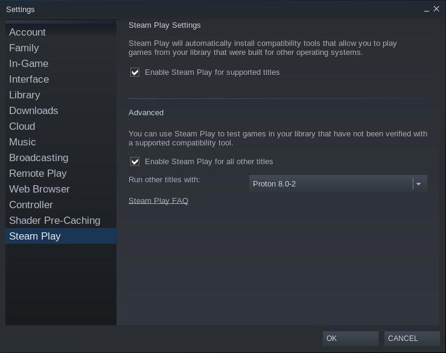

# Entertainment

- [Entertainment](#entertainment)
  - [Steam](#steam)
    - [Installation](#installation)
    - [Steam Play settings](#steam-play-settings)
      - [Play non-Steam games using Proton](#play-non-steam-games-using-proton)
  - [OpenSpades](#openspades)
    - [Tips](#tips)

## Steam

### Installation

- Install via `flatpak install flathub com.valvesoftware.Steam`.
  - For controller support, install drivers via `zypper install steam-devices`.
- Run via `flatpak run com.valvesoftware.Steam`.

References:

- https://flathub.org/en-GB/apps/com.valvesoftware.Steam
- https://github.com/flathub/com.valvesoftware.Steam/wiki#my-controller-isnt-being-detected
- [Is there any real “disadvantages” to using the FlatPak version of Steam? ](https://www.reddit.com/r/linux_gaming/comments/rp2ss9/is_there_any_real_disadvantages_to_using_the/)
- [How to Run Cyberpunk 2077 on Linux](https://segmentnext.com/cyberpunk-2077-linux/)

### Steam Play settings

#### Play non-Steam games using Proton

References:

- [How to add & play non-Steam games on Steam (on Linux with Proton)](https://www.youtube.com/watch?v=ZXPsIRGZizw)

## OpenSpades

- Install via `flatpak install flathub jp.yvt.OpenSpades`.
- Run via `flatpak run jp.yvt.OpenSpades`.

References:

- https://openspades.yvt.jp

### Tips

- You may want to run the game on NV card.
  - See [[Tumbleweed/tweak#Make applications run on NVidia card]].
  - After updating system's native driver, the driver in flatpak should also be updated before running the game.
- To make it run without window frame, add a rule in *System Settings* >> *Window Management* >> *Window Rules*:

  

[//begin]: # "Autogenerated link references for markdown compatibility"
[Tumbleweed/tweak#Make applications run on NVidia card]: ../openSUSE/Tumbleweed/tweak.md "Tweak openSUSE Tumbleweed on ThinkPad P1 Gen2"
[//end]: # "Autogenerated link references"
