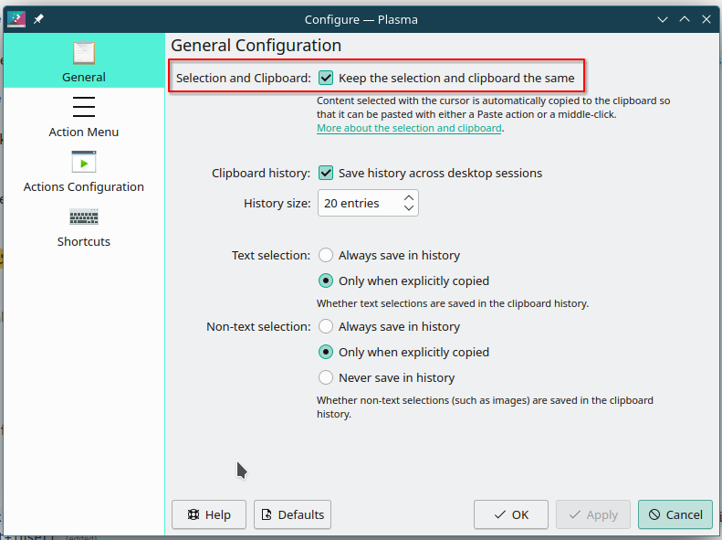

# Tweak openSUSE Tumbleweed on ThinkPad P1 Gen2

- [Change hostname](#change-hostname)
- [Network settings](#network-settings)
  - [WiFi](#wifi)
- [System update](#system-update)
- [Package management](#package-management)
- [Shell and terminal](#shell-and-terminal)
  - [Bash](#bash)
    - [Alias](#alias)
      - [Modify `.bash_aliases`](#modify-bash_aliases)
      - [Modify `.bashrc`](#modify-bashrc)
      - [auto-completion for aliases](#auto-completion-for-aliases)
  - [starship](#starship)
  - [WezTerm](#wezterm)
  - [Zellij](#zellij)
- [NVIDIA graphics card](#nvidia-graphics-card)
  - [Install driver and prime-select](#install-driver-and-prime-select)
  - [Make applications run on NVidia card](#make-applications-run-on-nvidia-card)
  - [If graphics driver or graphical desktop does not work](#if-graphics-driver-or-graphical-desktop-does-not-work)
  - [Benchmark](#benchmark)
- [Codecs](#codecs)
- [Fingerprint](#fingerprint)
- [IR camera](#ir-camera)
- [Bluetooth](#bluetooth)
- [Font](#font)
- [Locale](#locale)
- [Input method](#input-method)
  - [Rime](#rime)
- [Swappiness](#swappiness)
- [Power management](#power-management)
- [Grub2 theme](#grub2-theme)
- [KDE config](#kde-config)
- [Mouse](#mouse)
  - [Disable middle click](#disable-middle-click)
  - [Scroll speed](#scroll-speed)
- [Development environment](#development-environment)
- [Boot parameters](#boot-parameters)

*References*:

- https://opensuse.github.io/openSUSE-docs-revamped-temp/best_of_post/
- https://opensuse.github.io/openSUSE-docs-revamped-temp/safety_usability/
- https://averagelinuxuser.com/after-installing-opensuse/

## Change hostname

Change the hostname by the following commands:

```bash
sudo hostnamectl hostname NEW_HOSTNAME
```

## Network settings

### WiFi

- eduroam: refer to [the HKUST ITSC guide](https://itsc.hkust.edu.hk/services/general-it-services/wifi/wi-fi-services/configuration-eduroam).

## System update

Run the following commands:

```bash
sudo zypper refresh
sudo zypper dist-upgraded # optionally add "--no-recommends"
```

**Note**: An option `--no-recommends` can be added to only install required packages referring to [the Reddit post](https://www.reddit.com/r/openSUSE/comments/10rnrnu/zypper_keeps_installing_kde_games_on_update_how/) and [the blog](https://linuxkamarada.com/en/2021/04/07/what-are-recommended-packages-and-how-to-install-them-on-opensuse/).

*References*:

- https://en.opensuse.org/SDB:System_upgrade
- https://en.opensuse.org/SDB:Offline_upgrade

## Package management

See [[packages]].

## Shell and terminal

### Bash

#### Alias

##### Modify `.bash_aliases`

Add the following:

```bash
# sudo related
alias asudo='sudo ' # able to use aliases
alias esudo='sudo --preserve-env env "PATH=$PATH"' # able to use user PATH

# systemctl related
alias sysstatus='systemctl status'

# zypper related
alias sdz='sudo zypper'
alias z='zypper'

# flatpak related
alias fpk='flatpak'

# NVidia related
alias nv='__NV_PRIME_RENDER_OFFLOAD=1 __VK_LAYER_NV_optimus=NVIDIA_only __GLX_VENDOR_LIBRARY_NAME=nvidia'

# WARP
alias warp='warp-cli -vvv'
alias warpc='warp-cli -vvv connect'
alias warpd='warp-cli -vvv disconnect'

# Clash
alias clash='~/.clash/cfw'

# KVM
alias vstart='sudo systemctl start libvirtd.service && systemctl status libvirtd.service && sudo virsh net-start default && sudo virsh net-list --all && virt-manager'

# AppImages
alias eudic='~/bin/AppImage/eudic.AppImage'
alias ganache='~/bin/AppImage/ganache-2.7.1-linux-x86_64.AppImage'

# gaming
alias openspades='__NV_PRIME_RENDER_OFFLOAD=1 __VK_LAYER_NV_optimus=NVIDIA_only __GLX_VENDOR_LIBRARY_NAME=nvidia flatpak run jp.yvt.OpenSpades'
alias steam='flatpak run com.valvesoftware.Steam'

# misc
alias du='du --human-readable'
alias frp='~/.frp/frpc --config ~/.frp/frpc.ini'
alias rm='rm -I'
alias studio='/opt/android-studio/bin/studio.sh'
alias trash='gio trash'
alias xt='exit'
```

*References*:

- [Command not found when using sudo](https://stackoverflow.com/questions/12996397/command-not-found-when-using-sudo)
- [Why does `sudo env "PATH=$PATH"` do anything at all?](https://superuser.com/questions/1551566/why-does-sudo-env-path-path-do-anything-at-all)
- [Aliases not available when using sudo](https://askubuntu.com/questions/22037/aliases-not-available-when-using-sudo)

##### Modify `.bashrc`

Add the following:

```bash
# custom aliases
if [ -f ~/.bash_aliases ]; then
    . ~/.bash_aliases
fi
```

##### auto-completion for aliases

See [[bash#Auto-completion for aliases]].

### starship

1. Install CMake by `sudo zypper install cmake`.
2. Install Rust. See [[Tumbleweed/dev_env#Rust]].
3. Then install starship by `cargo install starship --locked`.
4. See [[shell#Starship]] for configuration.

*References*:

- [🚀 Installation](https://starship.rs/guide/#%F0%9F%9A%80-installation)

### WezTerm

1. See [[packages#WezTerm]] for installation.
2. See [[terminal#WezTerm]] for configuration.

### Zellij



## NVIDIA graphics card

### Install driver and prime-select

On my machine (*ThinkPad P1 Gen2 with T2000*), I tried 2 methods:

- Install legacy driver `x11-video-nvidiaG05` and `suse-prime`.
- Install the current driver `nvidia-video-G06` (or `nvidia-drivers-G06`) and `suse-prime`. At the time of updating (*Tumbleweed 20230518, KDE Plasma 5.27.5, NV driver 525.116.04*), it may result in a black SDDM login screen with only the cursor. This could be solved by holding `Ctrl` + `Alt` and pressing `Backspace` twice to restart the X server.

*References*:

- https://opensuse.github.io/openSUSE-docs-revamped-temp/hybrid_graphics/
- https://en.opensuse.org/SDB:NVIDIA_drivers
- https://en.opensuse.org/SDB:NVIDIA_troubleshooting
- https://en.opensuse.org/SDB:NVIDIA_SUSE_Prime
- [来到opensuse15.3的世界后，我推荐你做点什么](https://www.bwsl.wang/script/129.html)
- [Got a black screen with mouse cursor only after switching (on SDDM screen) a user session type between X11 and Wayland](https://forum.manjaro.org/t/got-a-black-screen-with-mouse-cursor-only-after-switching-on-sddm-screen-a-user-session-type-between-x11-and-wayland/87044/3)

### Make applications run on NVidia card

Use `__NV_PRIME_RENDER_OFFLOAD=1 __VK_LAYER_NV_optimus=NVIDIA_only __GLX_VENDOR_LIBRARY_NAME=nvidia SOME_APP_COMMAND`.

*References*:

- [Chapter 35. PRIME Render Offload](https://download.nvidia.com/XFree86/Linux-x86_64/525.116.04/README/primerenderoffload.html)
- [2.2.2 Configure applications to render using GPU](https://wiki.archlinux.org/title/PRIME#Configure_applications_to_render_using_GPU)
- [Prime-run command not found](https://askubuntu.com/questions/1364762/prime-run-command-not-found)
- [Prime-run on Ubuntu, openSUSE, and Fedora (Nvidia & Linux)](https://www.youtube.com/watch?v=aPi8NfDyDMU)

### If graphics driver or graphical desktop does not work

- Press `Ctrl+Alt+F4` to switch to virtual terminal 4.
- Press `Ctrl+Alt+F2` to switch back to the graphical desktop.
- Completely uninstall `nvidia-video-G06` (or `nvidia-drivers-G06`) via the following commands:

  ```bash
  zypper remove --clean-deps nvidia-drivers-G06 nvidia-video-G06 nvidia-driver-G06-kmp-default
  ```

*References*:

- [Accessing a TTY](https://www.howtogeek.com/428174/what-is-a-tty-on-linux-and-how-to-use-the-tty-command/#accessing-a-tty)
- [How to Access TTY in Linux?](https://itsfoss.com/what-is-tty-in-linux/#how-to-access-tty-in-linux)
- [The TTY demystified](https://www.linusakesson.net/programming/tty/index.php)
- [How to restart X and kde properly?](https://forums.opensuse.org/t/how-to-restart-x-and-kde-properly/61879)
- [Restart KDE in Kubuntu](https://www.maketecheasier.com/restart-frozen-desktop-linux/#restart-kde-kubuntu)

### Benchmark

Refer to [Arch wiki](https://wiki.archlinux.org/title/benchmarking#Graphics).

## Codecs

Refer to [the wiki](https://en.opensuse.org/SDB:Firefox_MP4/H.264_Video_Support) to enable firefox to play HTML5 videos.

- Method 1: For my machine I just installed the following packages from the *Packman* repository:
  - `libavcodec56`, `libavcodec57`, `libavcodec58`, `libavformat56`, `libavformat57`, `libavformat58`, `libavdevice56`, `libavdevice57`, `libavdevice58`
- Method 2: Use `opi codecs`.

*References*:

- https://en.opensuse.org/SDB:Installing_codecs_from_Packman_repositories
- https://opensuse.github.io/openSUSE-docs-revamped-temp/codecs/
- [some youtube videos don't play on firefox](https://www.reddit.com/r/openSUSE/comments/u0myze/some_youtube_videos_dont_play_on_firefox/)
- [openSUSE Simplifies Codec Installation](https://news.opensuse.org/2023/01/24/opensuse-simplifies-codec-install/)
- [I've been using OpenSuse Tumbleweed for 40 days. My experience. Great for gaming.](https://www.youtube.com/watch?v=owOSnus9XU0)

## Fingerprint

1. Check whether the device is supported from [the official page](https://fprint.freedesktop.org/supported-devices.html). Unsupported devices can be found [here](https://gitlab.freedesktop.org/libfprint/wiki/-/wikis/Unsupported%20Devices).

   USB Device info can be checked via `lsusb` or *Info Center* >> *Devices* >> *USB Devices*.
2. Install `fprintd` and `fprintd-pam`.
3. Add the following config to `/etc/pam.d/sddm`:

   ```text
   #%PAM-1.0
   auth     [success=1 new_authtok_reqd=1 default=ignore]   pam_unix.so try_first_pass likeauth nullok
   auth     sufficient      pam_fprintd.so
   ```

   **NOTE**: You may have to re-config `/etc/pam.d/sddm` after system updates. Refer to [the official wiki](https://en.opensuse.org/SDB:Facial_authentication#Known_issues).

4. Add the following config to `/etc/pam.d/kde` (create the file if there is no such file):

   ```text
   auth 			sufficient  	pam_unix.so try_first_pass likeauth nullok
   auth 			sufficient  	pam_fprintd.so
   ```

*References*:

- https://en.opensuse.org/SDB:Using_fingerprint_authentication

## IR camera

- [ ] set up facial auth

*References*:

- https://en.opensuse.org/SDB:Facial_authentication

## Bluetooth

See [[cross-distro/bluetooth]].

## Font

See [[fonts]].

## Locale

Change the system lock screen time format to 24H by adding `LC_TIME=C.UTF-8` to `/etc/locale.conf`.

*References*:

- https://wiki.archlinux.org/title/Locale
- https://askubuntu.com/questions/783184/how-to-display-kde-lock-screen-time-in-24-hour-format
- https://forum.manjaro.org/t/changing-the-lock-screen-clock-theme/114424
- https://www.reddit.com/r/kde/comments/kxr9qz/change_time_format_in_kde_lock_screen/

## Input method

### Rime

1. Use `zypper install fcitx5-rime` to install.
2. See [[rime#User config]] for configuration.

**Note**:

- `fcitx5-rime` is not responsible for the front end, which means `fcitx5.custom.yaml` does not control the look of the skin.
- At the time of writing (*Tumbleweed 20230322, KDE Plasma 5.27.3*), in order to display emoji correctly in the candidate list, add the following content to `~/.config/fontconfig/fonts.conf`:

  ```xml
  <match target="font">
      <test name="family" compare="contains">
          <string>Emoji</string>
      </test>
      <edit name="hinting" mode="assign">
          <bool>true</bool>
      </edit>
      <edit name="hintstyle" mode="assign">
          <const>hintslight</const>
      </edit>
      <edit name="embeddedbitmap" mode="assign">
          <bool>true</bool>
      </edit>
  </match>
  ```

*References*:

- https://rime.im/download/
- https://github.com/fcitx/fcitx-rime
- https://github.com/fkxxyz/rime-cloverpinyin/issues/50#issuecomment-835390794
- https://bugs.freedesktop.org/show_bug.cgi?id=104542
- https://www.freedesktop.org/software/fontconfig/fontconfig-user.html

## Swappiness

- Check the current swappiness by `cat /proc/sys/vm/swappiness`.
- Change the swappiness permanently by adding the following content to `/etc/sysctl.conf` (reboot may be required for the setting to take effect):

  ```text
  vm.swappiness=YOU_DESIRED_VALUE
  ```

## Power management

See [[power]] for power saving config.

## Grub2 theme

1. Download a theme from [Distro themes](https://k1ng.dev/distro-grub-themes/preview).
2. Unpack it and place the theme folder under `/boot/grub2/themes/`.
3. Use *YaST* to choose the `.txt` file.

## KDE config

See [[KDE]].

## Mouse

### Disable middle click

See [[Xorg#Disable middle click using ]].

### Scroll speed

See [[KDE#Mouse wheel scroll speed]].

## Development environment

See [[Tumbleweed/dev_env]].

## Boot parameters

At the time of writing (*Tumbleweed 20230605, kernel 6.3.4-1-default*), the default boot parameters are:

```text
splash=silent resume=/dev/disk/by-uuid/SWAP_UUID quiet security=apparmor nosimplefb=1
```

I modified the boot parameters to the following:

```text
resume=/dev/disk/by-uuid/SWAP_UUID security=apparmor nosimplefb=1
```

See [[boot_param]] for parameter meanings.

*References*:

- [SDB:Changing the Splash Screen's Default Settings](https://tr.opensuse.org/SDB:Changing_the_Splash_Screen%27s_Default_Settings)
- [Modifying kernel boot parameters](https://documentation.suse.com/smart/systems-management/html/task-modify-kernel-boot-parameter/index.html)
- [Grub boot options.](https://forums.opensuse.org/t/grub-boot-options/79823)

[//begin]: # "Autogenerated link references for markdown compatibility"
[packages]: packages.md "Package Management"
[bash#Auto-completion for aliases]: ../../cross-distro/bash.md "Bash Usage"
[Tumbleweed/dev_env#Rust]: dev_env.md "OpenSUSE Tumbleweed Development Environment"
[shell#Starship]: ../../../cross-platform/shell.md "Shell Related"
[packages#WezTerm]: packages.md "Package Management"
[terminal#WezTerm]: ../../../cross-platform/terminal.md "Terminal Related"
[cross-distro/bluetooth]: ../../cross-distro/bluetooth.md "Use the Same Bluetooth Device on Linux and Windows Dual Boot System"
[fonts]: ../../../cross-platform/fonts.md "Fonts"
[rime#User config]: ../../../cross-platform/rime.md "RIME | 中州韻輸入法引擎"
[power]: ../../cross-distro/power.md "Power Management"
[KDE]: ../../cross-distro/KDE.md "KDE Plasma Tweak"
[Xorg#Disable middle click using ]: ../../cross-distro/Xorg.md "X.Org"
[KDE#Mouse wheel scroll speed]: ../../cross-distro/KDE.md "KDE Plasma Tweak"
[Tumbleweed/dev_env]: dev_env.md "OpenSUSE Tumbleweed Development Environment"
[boot_param]: ../../cross-distro/boot_param.md "Boot Parameters"
[//end]: # "Autogenerated link references"
